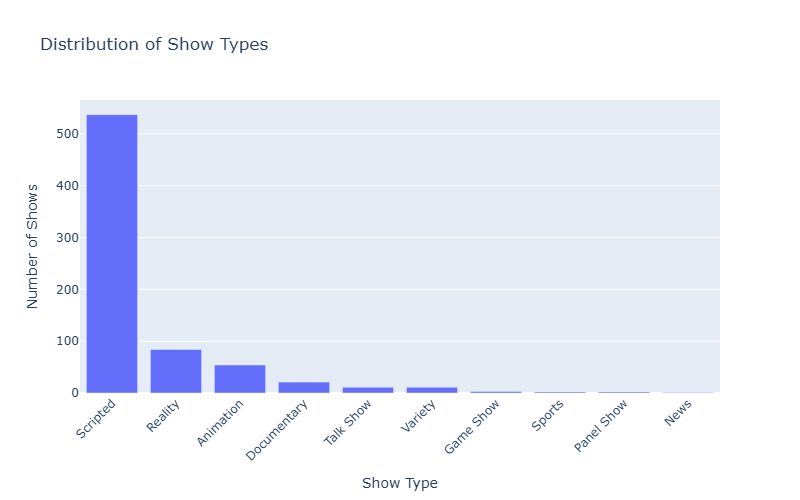
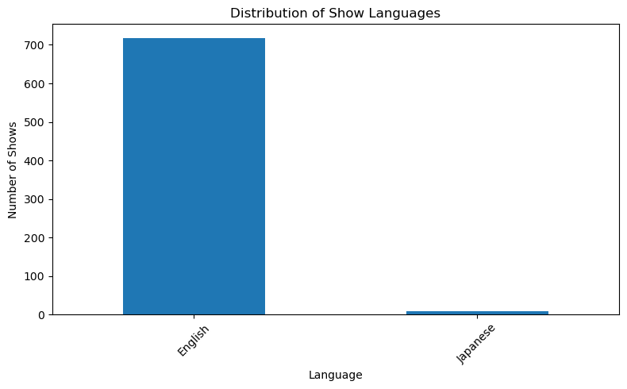
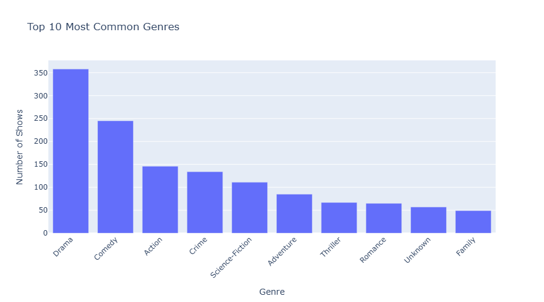
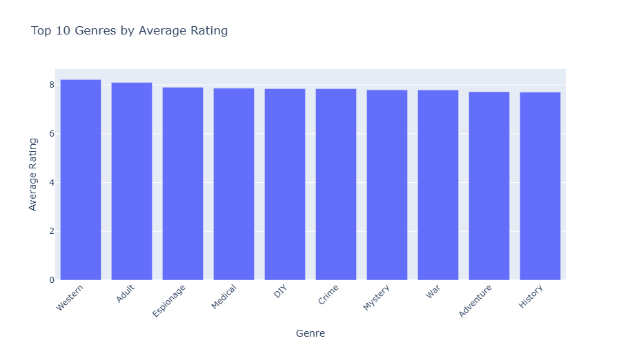
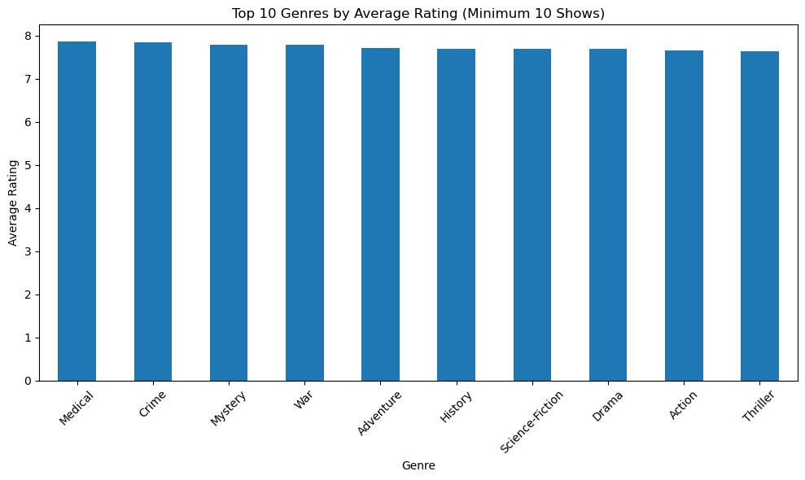
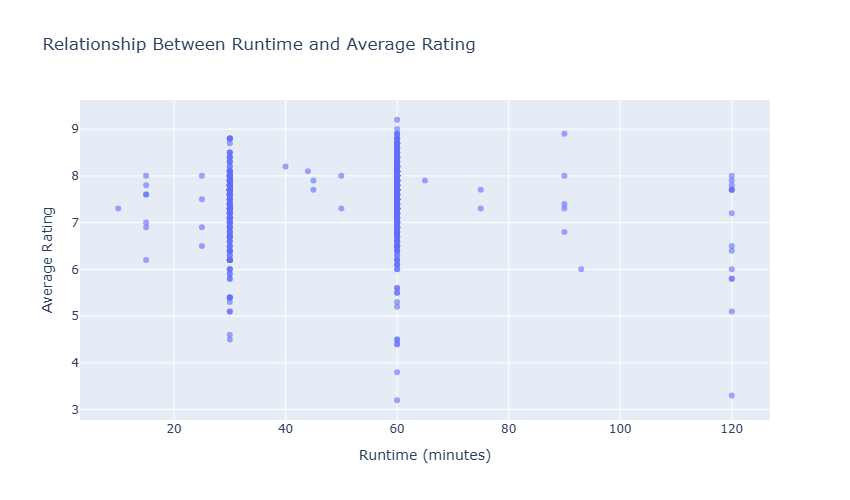
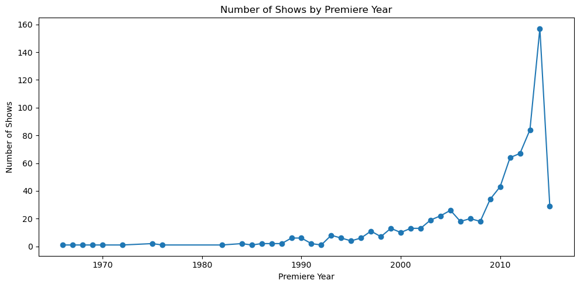
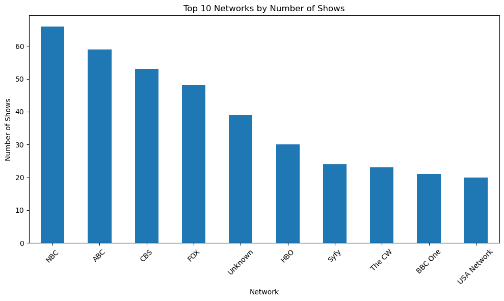
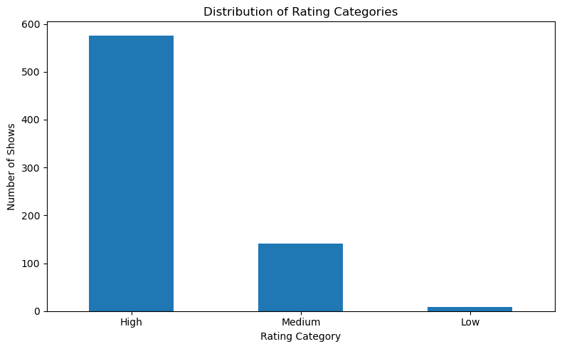
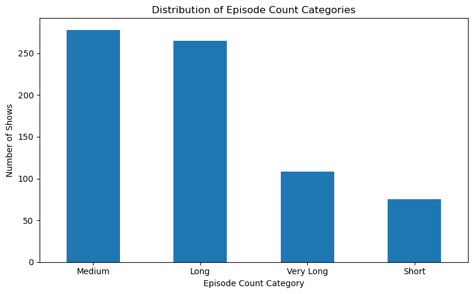

# Streaming Platform Content Strategy Using TVMaze API

## Project Overview

This project is about collecting TV show data from the TVMaze API and preparing it in a structured format for analysis. The data is used to understand TV show content, such as genres, languages, ratings, runtime, networks, episode counts, summaries, and release dates.

The main goal is to support business decisions for a streaming platform. As the founder of the platform, I want to use data to decide which types of content should be promoted, licensed, or prioritized in the future.

## Business Context

Streaming platforms need to choose their content carefully because content affects user engagement and platform growth. Instead of making decisions based only on assumptions, this project uses data to understand what types of shows are available and which content areas may be more valuable.

The business is a streaming platform that provides TV shows to users. The target users are viewers who watch different types of content, such as drama, comedy, action, documentary, and other genres.

## Problem Statement

The main problem is deciding which types of content the streaming platform should focus on. Without data, the platform may invest in shows or genres that are not strong enough based on rating, availability, content volume, or market trends.

By analyzing TV show data, the platform can make better decisions about content acquisition, promotion, and future investment.

## Data Sources

### TVMaze Shows API

The main data was collected from the TVMaze public Shows API using API requests. TVMaze provides TV show information in JSON format, including show names, types, languages, genres, ratings, runtime, premiere dates, status, networks, countries, and summaries.

I selected this API because it is public, easy to access, does not require an API key, and provides useful TV show data for a streaming platform case study.

API documentation:

https://www.tvmaze.com/api

General endpoint format:

https://api.tvmaze.com/shows?page={page_number}

Example endpoint used:

https://api.tvmaze.com/shows?page=1

Since the API uses pages, I collected multiple pages using the `page` parameter to make sure the dataset contains more than 500 records.

The raw collected dataset contains 750 TV show records collected from multiple pages of the TVMaze API.

Date of data collection: May 3, 2026.

### TVMaze Episodes API

To enrich the dataset, I also used the TVMaze Episodes API. This endpoint was used to collect episode data for each show based on its `show_id`.

API documentation:

https://www.tvmaze.com/api

General endpoint format:

https://api.tvmaze.com/shows/{show_id}/episodes

Example endpoint used:

https://api.tvmaze.com/shows/1/episodes

The number of episodes returned for each show was counted and added as a new feature called `episode_count`.

## Dataset Description

The project includes three main data files.

### shows_raw.csv

This file contains the raw data collected from the TVMaze Shows API and saved as a CSV file. It keeps the original fields returned by the API, including some nested fields such as rating, network, schedule, externals, and links.

Each row represents one TV show.

### shows_structured.csv

This file contains a more structured version of the raw data. Some nested JSON fields were extracted and converted into separate columns to make the dataset easier to read and analyze.

Each row represents one TV show.

### shows_cleaned.csv

This file contains the final cleaned and feature-engineered dataset produced in Step 2. It includes the structured columns plus new features created during cleaning, feature engineering, sentiment analysis, keyword extraction, readability analysis, topic modeling, clustering, PCA, and external API integration.

Each row represents one TV show.

### Main Columns in `shows_structured.csv`

| Column | Description |
|---|---|
| `show_id` | Unique ID of the TV show |
| `name` | Name of the TV show |
| `type` | Type of show, such as Scripted or Reality |
| `language` | Original language of the show |
| `genres` | Genres related to the show |
| `status` | Current status of the show |
| `runtime` | Runtime of the show in minutes |
| `average_runtime` | Average runtime in minutes |
| `premiered` | Date when the show first premiered |
| `ended` | Date when the show ended, if available |
| `official_site` | Official website of the show |
| `rating_average` | Average rating of the show |
| `network_name` | Name of the network that aired the show |
| `country_name` | Country of the network |
| `country_code` | Country code of the network |
| `summary` | Short description of the show |

### New Columns in `shows_cleaned.csv`

| Column | Description |
|---|---|
| `premiere_year` | Year extracted from the premiere date |
| `premiere_month` | Month extracted from the premiere date |
| `is_ended` | Indicates whether the show has an end date |
| `show_age` | Number of years since the show premiered |
| `genre_count` | Number of genres assigned to the show |
| `summary_word_count` | Number of words in the cleaned summary |
| `summary_character_count` | Number of characters in the cleaned summary |
| `summary_keywords` | Important keywords extracted from the cleaned show summary |
| `sentence_count` | Number of sentences in the cleaned show summary |
| `average_sentence_length` | Average number of words per sentence in the cleaned show summary |
| `average_word_length` | Average length of words in the cleaned show summary |
| `sentiment_score` | Sentiment polarity score of the show summary, ranging from -1 to +1 |
| `sentiment_label` | Sentiment category: Positive, Neutral, or Negative |
| `summary_topic` | Topic number assigned using topic modeling on the cleaned show summary |
| `rating_category` | Rating group: Low, Medium, or High |
| `content_cluster` | Content segment assigned by KMeans clustering based on selected numerical features |
| `episode_count` | Number of episodes collected from the TVMaze Episodes API |
| `episode_count_category` | Category based on episode count: Short, Medium, Long, or Very Long |
| `pca_component_1` | First PCA component created from selected standardized numerical features |
| `pca_component_2` | Second PCA component created from selected standardized numerical features |

## Sample Output

After collecting, cleaning, and enriching the data, the project includes the following datasets:

| File | Number of Records | Description |
|---|---:|---|
| `shows_raw.csv` | 750 | Raw TV show data collected from the TVMaze Shows API |
| `shows_structured.csv` | 750 | Structured TV show data with selected and extracted columns |
| `shows_cleaned.csv` | 726 | Cleaned and feature-engineered dataset used for analysis |

The cleaned dataset has fewer rows because rows with missing premiere dates were removed during the cleaning step. The premiere date is important for time-based analysis.

## Data Types Overview

### Qualitative Data

Qualitative data describes categories or text values.

Examples from this dataset:

- Show name
- Type
- Language
- Genres
- Status
- Network name
- Country name
- Summary
- Summary keywords
- Sentiment label
- Summary topic
- Rating category
- Content cluster
- Episode count category

### Quantitative Data

Quantitative data represents numerical values.

Examples from this dataset:

- Show ID
- Runtime
- Average runtime
- Rating average
- Show age
- Genre count
- Summary word count
- Summary character count
- Sentence count
- Average sentence length
- Average word length
- Sentiment score
- Episode count
- PCA components

### Measurement Types

| Measurement Type | Columns |
|---|---|
| Nominal | `name`, `type`, `language`, `genres`, `status`, `network_name`, `country_name`, `summary_keywords`, `sentiment_label`, `summary_topic`, `content_cluster` |
| Ordinal | `rating_category`, `episode_count_category` |
| Interval | `premiered`, `ended`, `sentiment_score`, `pca_component_1`, `pca_component_2` |
| Ratio | `runtime`, `average_runtime`, `show_age`, `genre_count`, `summary_word_count`, `summary_character_count`, `sentence_count`, `average_sentence_length`, `average_word_length`, and `episode_count` |

## Research Questions

The following questions help guide the analysis and support content strategy decisions:

1. Which genres have the highest average ratings?
2. Which languages are most common in the TV show catalog?
3. Is there a relationship between runtime and average rating?
4. Which networks produce the highest-rated shows?
5. How has TV show production changed over time based on premiere dates?
6. Which content types or genres should the platform prioritize based on rating and availability?
7. How can episode count help understand show length and content volume?

## Methodology

### Data Collection Approach

The data was collected using Python API requests from the TVMaze public API. Since the Shows API is paginated, multiple pages were requested using the `page` parameter. The raw collected dataset contains 750 TV show records.

The API returned the data in JSON format. After that, the JSON response was converted into Pandas DataFrames and saved as CSV files.

An additional TVMaze endpoint was also used to enrich the dataset with episode count information. For each show, the Episodes API was requested using the show ID, and the number of returned episodes was counted.

### Data Transformation Steps

The raw API response included nested fields, such as:

- rating
- network
- genres

These fields were transformed into clearer columns, such as:

- `rating_average`
- `network_name`
- `country_name`
- `country_code`
- `genres`

The final structured dataset from Step 1 was saved as `shows_structured.csv`.

## Tools and Libraries Used

| Tool / Library | Purpose |
|---|---|
| Python | Main programming language used for data collection, cleaning, and analysis |
| Requests | Used to send API requests to TVMaze |
| Pandas | Used for data manipulation, cleaning, and transformation |
| NumPy | Used for numerical operations |
| Matplotlib | Used to create visualizations |
| TextBlob | Used for sentiment analysis on show summaries |
| scikit-learn | Used for StandardScaler, KMeans clustering, PCA, TF-IDF, and NMF topic modeling |
| Jupyter Notebook | Used to document and run the full workflow |
| TVMaze API | Main data source for show and episode data |


## Generated Files

The project files are organized as follows:

```text
streaming-content-strategy/
│
├── tvmaze_api_data_collection.ipynb
├── tvmaze_cleaning.ipynb
├── README.md
│
├── data/
│   ├── raw/
│   │   ├── shows_raw.csv
│   │   └── shows_structured.csv
│   │
│   └── cleaned/
│       └── shows_cleaned.csv
│
└── images/
    ├── show_types.png
    ├── languages.png
    ├── genres.png
    ├── genre_ratings.png
    ├── Average_Rating_Minimum.png
    ├── runtime_rating.png
    ├── premiere_trends.png
    ├── networks.png
    ├── rating_categories.png
    └── episode_count.png
```

### Folder Description

| Folder / File | Description |
|---|---|
| `tvmaze_api_data_collection.ipynb` | Notebook used to collect data from the TVMaze Shows API |
| `tvmaze_cleaning.ipynb` | Notebook used for data cleaning, feature engineering, EDA, and bias evaluation |
| `README.md` | Project documentation |
| `data/raw/` | Contains the original raw and structured datasets from Step 1 |
| `data/cleaned/` | Contains the final cleaned and feature-engineered dataset |
| `images/` | Contains visualization screenshots used in the README |

---

## Step 2: Data Processing, Cleaning, Feature Engineering, and EDA

## Data Processing & Cleaning

The dataset was inspected before cleaning to understand its structure, data types, missing values, duplicate records, irrelevant features, and inconsistent values.

The following cleaning steps were applied:

| Step | Description |
|---|---|
| Missing values inspection | Checked missing values and missing percentages for each column |
| Duplicate check | Checked whether the dataset contained duplicate rows |
| Statistical summaries | Reviewed numerical and categorical summaries |
| Date conversion | Converted `premiered` and `ended` columns from string format to datetime format |
| Missing premiere dates | Removed rows with missing `premiered` values because the premiere date is needed for time-based analysis |
| Missing categorical values | Filled missing values in `genres`, `network_name`, `country_name`, and `country_code` with `Unknown` |
| Missing official sites | Filled missing `official_site` values with `Not Available` |
| Missing numerical values | Filled missing values in `runtime`, `average_runtime`, and `rating_average` using the median |
| Ended column | Kept missing values in `ended` because missing end dates may indicate that the show is still running |
| Text cleaning | Removed HTML tags from the `summary` column |
| Irrelevant and inconsistent features review | Reviewed the dataset columns and kept features useful for content strategy analysis. Missing or inconsistent fields were handled based on their meaning |
| Standardization | Numerical features used for KMeans clustering and PCA were standardized using `StandardScaler` so each feature contributes more equally to the process |

After cleaning and feature engineering, the final cleaned dataset was saved as `data/cleaned/shows_cleaned.csv`.

## Feature Engineering

Several new features were created to support deeper analysis and make the dataset more useful for EDA.

The created features include:

| Feature | Description |
|---|---|
| `premiere_year` | Year extracted from the premiere date to analyze trends over time |
| `premiere_month` | Month extracted from the premiere date to support time-based analysis |
| `is_ended` | Shows whether a show has an end date or may still be running |
| `show_age` | Calculates how many years have passed since the show premiered |
| `genre_count` | Counts how many genres are assigned to each show |
| `summary_word_count` | Counts the number of words in the cleaned show summary |
| `summary_character_count` | Counts the number of characters in the cleaned show summary |
| `summary_keywords` | Extracts important keywords from the cleaned show summary |
| `sentence_count` | Counts the number of sentences in the cleaned show summary |
| `average_sentence_length` | Calculates the average number of words per sentence |
| `average_word_length` | Calculates the average word length in the cleaned show summary |
| `sentiment_score` | Calculates the sentiment polarity of each cleaned show summary using TextBlob |
| `sentiment_label` | Classifies the summary sentiment as Positive, Neutral, or Negative |
| `summary_topic` | Groups show summaries into general topics using topic modeling |
| `rating_category` | Groups shows into Low, Medium, and High rating categories |
| `content_cluster` | Groups shows into content segments using KMeans clustering |
| `episode_count` | Counts the number of episodes for each show using the TVMaze Episodes API |
| `episode_count_category` | Groups shows into Short, Medium, Long, and Very Long categories based on episode count |
| `pca_component_1` | First PCA component created from selected standardized numerical features |
| `pca_component_2` | Second PCA component created from selected standardized numerical features |

Text-based feature engineering was applied to the `summary` column. HTML tags were removed, and word count, character count, keyword extraction, readability features, topic modeling, sentiment score, and sentiment label features were created to convert text into useful analytical features.

### Feature Engineering Documentation

| Technique | What was done | Why it was necessary | How it was implemented |
|---|---|---|---|
| Date-based features | Created `premiere_year` and `premiere_month` | To analyze release trends over time | Extracted year and month from the `premiered` datetime column |
| Derived metrics | Created `show_age` and `genre_count` | To measure how old each show is and how diverse its genres are | Calculated show age using the premiere year and counted genres by splitting the genre list |
| Rating classification | Created `rating_category` | To group shows into easier rating levels for analysis | Used rating ranges to classify shows as Low, Medium, or High |
| Text-based counting features | Created `summary_word_count` and `summary_character_count` | To convert summary text into numerical features | Cleaned the summary text and counted words and characters |
| Language and readability features | Created `sentence_count`, `average_sentence_length`, and `average_word_length` | To describe the length and complexity of show summaries | Used text splitting and regular expressions to calculate sentence count, average sentence length, and average word length |
| Keyword extraction | Created `summary_keywords` | To identify important terms and themes from show summaries | Removed common stop words and extracted the most frequent meaningful words from each cleaned summary |
| Sentiment analysis | Created `sentiment_score` and `sentiment_label` | To capture the general tone of each show summary | Used TextBlob to calculate sentiment polarity and assign sentiment labels |
| Topic modeling | Created `summary_topic` | To identify general themes from show summaries | Applied TF-IDF vectorization and NMF topic modeling on the cleaned summary text |
| Clustering | Created `content_cluster` | To group shows into content segments based on numerical patterns | Standardized selected numerical features using `StandardScaler` and applied KMeans clustering |
| PCA dimensionality reduction | Created `pca_component_1` and `pca_component_2` | To reduce selected numerical features into two components for exploratory analysis | Standardized selected numerical features and applied PCA with two components |
| External API enrichment | Created `episode_count` and `episode_count_category` | To add content volume information that was not available in the original show-level dataset | Requested the TVMaze Episodes API for each show ID and counted the number of returned episodes |

### Notes on Techniques Not Applied

Some techniques mentioned in the task were reviewed but not applied because they were not suitable for this dataset.

| Technique | Reason |
|---|---|
| Hashtag, mention, and emoji detection | These techniques were not applied because the dataset does not contain social media text, hashtags, mentions, or emojis. |
| Advanced readability metrics | Basic readability-related features were created using sentence count, average sentence length, and average word length. More advanced readability metrics can be added in future work if deeper text analysis is needed. |

### External Data Integration

| Point | Explanation |
|---|---|
| What was done | Episode count data was collected from the TVMaze Episodes API for each show and added as a new feature called `episode_count` |
| Why it was necessary | The original show-level dataset did not include episode count information. Adding this feature allows the analysis to consider show length and content volume, which can support content strategy decisions |
| How it was implemented | A loop was used to request the TVMaze Episodes API for each `show_id`. The number of episodes returned by the API was counted and stored in the `episode_count` column. A second feature, `episode_count_category`, was created to group shows into Short, Medium, Long, and Very Long categories |

## Bias & Fairness

### Research Summary

Data bias occurs when a dataset does not represent all groups equally, when data is collected or measured in an unfair way, or when historical patterns are reflected in the dataset. These issues can lead to unfair or incomplete conclusions.

Common sources of bias include:

| Bias Type | Description |
|---|---|
| Representation bias | Happens when some groups are overrepresented or underrepresented in the dataset |
| Measurement bias | Happens when values are collected or measured in a way that is not equally accurate for all groups |
| Historical bias | Happens when the dataset reflects existing historical patterns or inequalities |
| Missing data bias | Happens when missing values are not random and affect certain groups more than others |

Some existing frameworks and guidelines used to evaluate bias include:

- IBM AI Fairness 360
- Google What-If Tool
- Fairness guidelines that recommend comparing results across important groups before making decisions

### Dataset Bias Evaluation

| Bias Area | Evaluation |
|---|---|
| Representation Bias | The dataset is strongly concentrated around English-language shows and Scripted content. Non-English shows and other content types such as Reality, Documentary, Talk Show, and News are underrepresented. This means that the analysis may favor English scripted content over other types of content. |
| Measurement Bias | Several columns contain missing values, especially `rating_average`, `network_name`, `genres`, and `official_site`. Ratings are not available for all shows equally, which may affect comparisons between genres, networks, and content types. Missing numerical values were filled using the median, which helped keep the dataset usable but may also affect the true distribution of ratings. |
| Historical Bias | The dataset reflects the shows available in the TVMaze API and the selected pages collected. Older shows, specific networks, and English-language content may be represented differently, which means the data may reflect historical availability patterns rather than the full TV market. |

### Impact on Results

These biases may affect the final insights and recommendations. For example, the platform may appear to benefit more from investing in English scripted content simply because it is highly represented in the dataset.

Also, genres with very few shows may appear to have high or low average ratings, but the sample size may not be large enough to make a strong decision. For this reason, genre rating analysis should consider both rating and show count.

### Recommendations to Mitigate Bias

To reduce bias in future analysis, the following steps are recommended:

- Collect more data from additional TVMaze API pages or endpoints.
- Include more non-English and international content.
- Compare results across different languages, countries, and content types separately.
- Avoid making decisions based only on categories with very small sample sizes.
- Clearly document missing data and avoid over-interpreting incomplete fields.
- Consider using additional external data sources to validate findings.

## EDA Findings

The EDA process included statistical summaries, visualizations, genre analysis, rating analysis, correlation analysis, trend analysis, and episode count analysis.

### Distribution of Show Types

The majority of shows in the dataset are Scripted. Other types such as Reality, Animation, Documentary, Talk Show, and News appear much less frequently. This suggests the dataset is strongly concentrated around scripted content.



### Distribution of Languages

The dataset is highly concentrated around English-language shows. This indicates a strong language imbalance that may affect recommendations and genre analysis.



### Most Common Genres

Drama is the most common genre, followed by Comedy, Action, Crime, and Science-Fiction. The presence of Unknown in the genre data indicates that some shows did not have genre information available in the API.



### Average Rating by Genre

After filtering for genres with at least 10 shows, Medical, Crime, Mystery, War, and Adventure appear among the highest-rated genres. Drama and Action are among the most common but not necessarily the highest-rated genres.





### Runtime and Rating Relationship

The correlation between runtime and average rating is 0.031, which indicates a very weak relationship. Runtime does not appear to be a strong predictor of show quality based on this dataset.



### Show Production Trends Over Time

The number of premiered shows increased gradually over time, with a peak around 2014. The drop after the peak may reflect how the API data was collected rather than an actual decline in TV production.



### Top Networks

NBC, ABC, CBS, FOX, and HBO are the top networks by number of shows. The dataset is strongly represented by major U.S. networks.



### Rating Category Distribution

Most shows fall under the High rating category. However, this result should be interpreted carefully because missing ratings were filled using the median, which may have increased the number of shows in the High or Medium rating categories.



### Episode Count Category Distribution

Medium and Long shows are the most common in the dataset, while Short and Very Long shows appear less frequently. This suggests that the catalog is mainly concentrated around shows with moderate to high episode counts.

For the streaming platform, this may indicate stronger content continuity and better potential for longer viewer engagement.



## Key Challenges

| Challenge | Description |
|---|---|
| Nested JSON Fields | Some fields in the API response were nested, such as rating and network information. These fields were extracted and converted into separate columns. |
| Missing Values | Some shows did not have complete information, such as ratings, network details, official websites, genres, or ended dates. These missing values were handled based on the meaning of each column. |
| Pagination | The API returns data in pages, so multiple pages were collected to make sure the dataset contains more than 500 records. |
| Imbalanced Representation | The dataset is highly concentrated around English-language shows and Scripted content. This imbalance was considered during the bias and fairness evaluation. |
| Text Cleaning | The `summary` column originally contained HTML tags. These tags were removed before creating text-based features such as word count, character count, readability features, keyword extraction, topic modeling, sentiment score, and sentiment label. |
| External API Requests | Collecting episode counts required sending an API request for each show. This step took longer than the original data collection because each show needed a separate request to the TVMaze Episodes API. |
| Feature Engineering Scope | Advanced feature engineering steps, such as sentiment analysis, topic modeling, PCA, clustering, and episode count categorization, were applied in a simple exploratory way. These features should be interpreted as analytical support features, not final production-ready model outputs. |

## Future Steps

### Hypotheses for Further Investigation

- High-rated genres such as Medical and Crime may perform better on streaming platforms compared to more common genres like Drama and Action.
- Non-English content may have untapped potential that is not visible in this dataset due to underrepresentation.
- Shows with longer summaries may be associated with more complex content and potentially higher ratings.
- Shows with higher episode counts may indicate stronger content continuity or long-term audience interest.
- Networks with high-rated shows may be good candidates for future content partnerships.

### Additional Data Needed

- User engagement data such as views, watch time, and completion rates.
- More pages and endpoints from the TVMaze API to improve coverage of recent and international shows.
- External ratings from sources such as IMDb or Rotten Tomatoes for cross-validation.
- Demographic data about audiences to understand content preferences by region.
- Subscription or platform usage data to connect content characteristics with user behavior.

### Potential Models and Analyses

- A recommendation model that suggests content based on genre, rating, language, network, and episode count.
- A classification model to predict whether a new show will receive a High, Medium, or Low rating.
- A clustering analysis to group shows into content segments for targeted promotion.
- A time series analysis to identify trends in TV show production and genre popularity over time.
- A fairness-focused analysis that compares recommendations across languages, countries, and content types.

## Current Step

This repository covers:

- Step 1: Data Collection and Preparation
- Step 2: Data Processing, Cleaning, Feature Engineering, Exploratory Data Analysis, and Bias & Fairness Evaluation